### `alex@github ~ $ whoami`

<table>
  <tr>
    <td valign="top"></td>
    <td valign="top"></td>
  </tr>
</table>

 

### `alex@github ~ $ ./contributions.sh`

 

### `alex@github ~ $ cat mission.txt`

DevOps Intern at **Nuvo Prime**, building dependable systems from infrastructure to interface.

`automation` · `CI/CD` · `full-stack development` · `reliable delivery`

